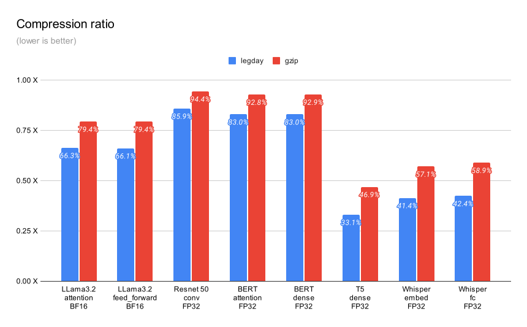
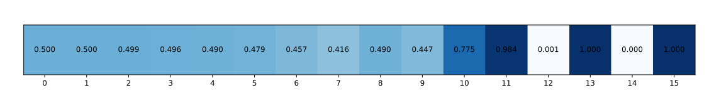
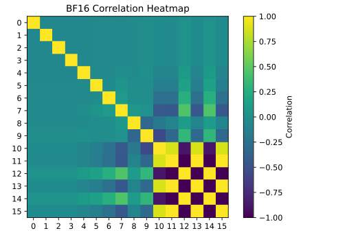
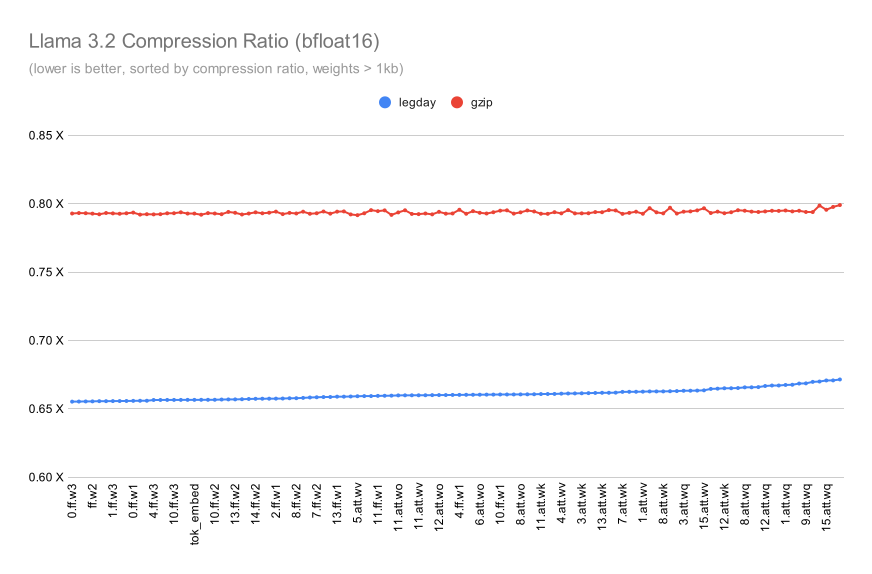

# legday

>This is a personal experiment for a toy lossless compressor for ML tensors.
>It's not intended for production use.
> Use [zstandard](https://github.com/facebook/zstd) for anything serious.

This repository implements a small, lossless compressor for ML weights. It
guarantees that the decompressed weights are bit-by-bit identical to the
originals. I threw together this code in a few afternoons—just 250 lines of
dependency-free C++.

To get the best compression ratio, you need to compress weights one by one.
This compressor operates on each tensor individually in two phases.
First, a preprocessing step that transforms the tensor into a format that
is more amenable to compression. Second, a compression step that uses an
arithmetic coder to compress the tensor.

This benchmark shows the compression ratios for a few models from HuggingFace
The weights are encoded in Float32 or BF16. The figures represent the size
compared to the original model, and lower is better.



# Command-line utility

The repository contains a library and a command-line utility.

I use a command-line tool to compress, decompress, and verify that the
compression is lossless. Usage:

```
legday [compress|decompress|verify] [INT8|BF16|FP32] <input> <output>
```

This repo comes with a script that dumps weights from a PyTorch model. You'll
need to install the PyTorch environment using the script in
`scripts/create_venv.sh`. Usage:

```
python scripts/dump_weights.py <path to model>
```

# How it works

Compressing ML weights with gzip does not work well because gzip depends on
patterns that don't appear in ML weights. Gzip works by identifying repetitions
and then encoding indices and fragments using huffman coding. The problem is
that ML weights are not repetitive. The values are unique, and the huffman coder
is not configured to handle this well. In this section we'll describe an
alternative strategy that works better.

There are a few tricks that Legday uses to compress ML weights well: compressing
weights independently, compressing bit-channels independently, using an
arithmetic coder, biasing the exponent, and using conditional probabilities.

To understand the tricks, let's start by looking at the structure of
floating-point numbers.


Floating-point numbers consist of a sign bit, an exponent, and a mantissa.
Typically, ML weights are small values centered around zero, from -1 to 1.
The range between 0x3f80 (1.0) and 0x6f80 (7.9e+28) is unused. This may seem
like a big range, but it's not. Only a few bits separate the two values.
In fact, most of the compression comes from reducing the range of the exponent.

Legday compresses one bit-channel at a time using an arithmetic coder.
Values with sharp distributions compress well, but random ones don't.
Most of the gains come from bits that are almost always either zero or one.
Let's take a look at the distribution of the float for a typical weight.



The values of the mantissas are close to random, with around 50% of
the bits being one and 50% being zero. In this example the exponent and sign
bits show clear patterns. A bit-wise arithmetic coder can compress these
patterns very well. The bits that are almost always zero or one compress well,
but most of the bits don't have sharp distributions. We need to do a little
more work to transform data to expose more opportunities.

To demonstrate the remaining opportunities, consider an array of 32-bit signed
integers in the range -1..1.  The array will be filled with numbers that look
like 0xffff, 0x0000, and 0x0001.  This means that the distribution of most of
the bits would be around 50% and we won't be able to compress them! But what if
the numbers were in the range 0..2? Now the array will be filled with numbers
that look like 0x0000, 0x0001, and 0x0002, and high bits would be constant zero.
By adding an offset of 1, we change the distribution of many bits!

Legday transforms the floating point number in a few steps before we encode each
bit independently.  The first step is to move all of the exponent bits into one
byte. We simply rotate the float and push the sign bit to the back. This works
for both BF16 and FP32.

Next, we transform the values to make the distribution of values sharper.  Each
ML weight has a different distribution of numbers, so the transformation has to
be dynamic.  Legday reduces the variance in the distribution of bits by sorting
the exponent values according to their probability. By placing the most frequent
values next to one another we reduce the Hamming distance between the common
values.



This picture shows the difference between the expected correlation and the
measured correlation after applying the transformation. As expected, the
correlation between bits is reduced.

However, there is one last trick. When we scan the input vector we calculate the
conditional probabilities. We create a small table that says that if the last
four bits were '0101' then the next bit has a probability of 45% and if the last
few bits were '0001', then the probability of the next bit is 34%. At this phase
the signals are very weak and the gains are very small. The arithmetic encoder
uses the slightly more accurate bit predictions to generate smaller sequences.

One of the cool things about this compression method is that it's easy to
see how each bit channel is compressed. The table below shows the bit
probability and the resulting packet size for each bit channel. The table below
is consistent with our projection.

|Bit | 0 | 1 | 2 | 3 | 4 | 5 | 6 | 7 | 8 | 9 | 10 | 11 | 12 | 13 | 14 | 15 |
|-|-|-|-|-|-|-|-|-|-|-|-|-|-|-|-|-|
|Probability: |0.50| 0.50| 0.50| 0.50| 0.49| 0.48| 0.46| 0.42| 0.48| 0.50| 0.82| 0.99| 0.00| 1.00| 0.00| 1.00|
|Compressed Size: |2097k|2097k|2097k|2097k|2096k|2094k|2085k|2054k|2095k|2097k|1432k|210k|24k|1k|0k|0k|


# Benchmark

Here’s a comparison of all weights over 1k from LLaMA3.2, sorted by how well
they compress. The weights are encoded in BF16. The model is from HuggingFace.




# Summary

That’s it! This toy compressor isn’t perfect, but it gets very close to the
[optimal](https://arxiv.org/abs/2404.10896) lossless compression ratios. It’s
slow and experimental, so don’t use it for anything. Always pick zstandard for
anything serious.
