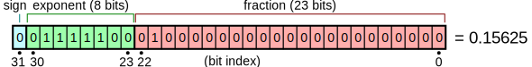
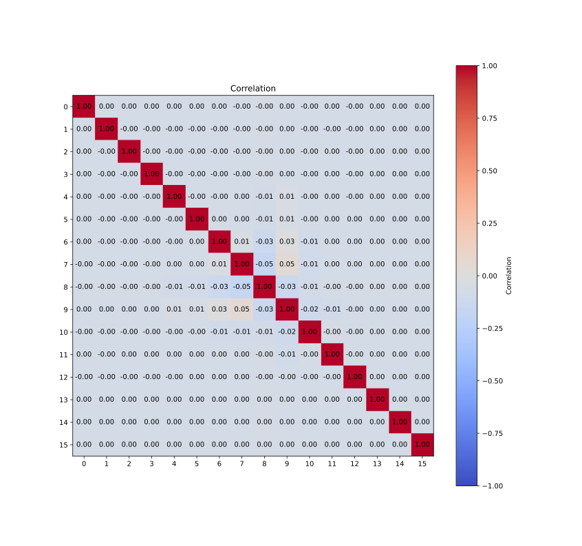
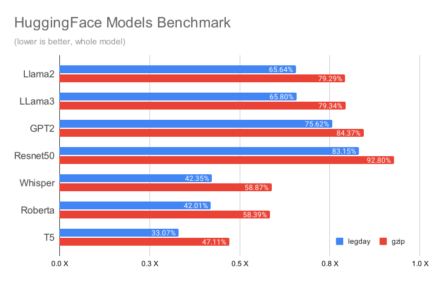

# legday

>This is a personal experiment for a toy lossless compressor for ML tensors.
>It's not intended for production use. 
> Use [zstandard](https://github.com/facebook/zstd) for anything serious. 

This repository implements a small, lossless compressor for ML weights. It
guarantees that the decompressed weights are bit-by-bit identical to the
originals. I threw together this code in a few afternoons—just 250 lines of
dependency-free C++.

To get the best compression ratio, you need to compress weights one by one.
This compressor operates on each tensor individually in two phases.
First, a preprocessing step that transforms the tensor into a format that
is more amenable to compression. Second, a compression step that uses an
arithmetic coder to compress the tensor. 

Legday compresses llama weights to around 68%, while gzip compresses it to 79%.

# Command-line utility

The repository contains a library and a command-line utility.

I use a command-line tool to compress, decompress, and verify that the
compression is lossless. Usage: 

```
legday [compress|decompress|verify] [INT8|BF16|FP32] <input> <output>
```

This repo comes with a script that dumps weights from a PyTorch model. You'll 
need to install the PyTorch environment using the script in
 `scripts/create_venv.sh`. Usage:

```
python scripts/dump_weights.py <path to model>
```

# How it works

Compressing ML weights with gzip does not work well because gzip depends on
patterns that don't appear in ML weights. Gzip works by identifying repetitions
and then encoding indices and fragments using huffman coding. The problem is
that ML weights are not repetitive. The values are unique, and the huffman coder
is not configured to handle this well. In this section we'll describe an
alternative strategy that works better.

There are a few tricks that Legday uses to compress ML weights well:
compressing each weight independently, compressing each bit-channel 
independently, using an arithmetic coder, biasing the exponent, and enumerating
values that reduce correlation between bits. 

To understand the tricks, let's start by looking at the structure of 
floating-point numbers.



Floating-point numbers consist of a sign bit, an exponent, and a mantissa.
Typically, ML weights are small values centered around zero, from -1 to 1.
The range between 0x3f80 (1.0) and 0x6f80 (7.9e+28) is unused. This may seem
like a big range, but it's not. Only a few bits separate the two values.
In fact, most of the compression comes from reducing the range of the exponent. 

Legday compresses one bit-channel at a time using an arithmetic coder.
Values with sharp distributions compress well, but random ones don't.
Most of the gains come from bits that are almost always either zero or one.
Let's take a look at the distribution of the float for a typical weight.


The values of the mantissas are close to random, with around 50% of
the bits being one and 50% being zero. In this example the exponent and sign
bits show clear patterns. A bit-wise arithmetic coder can compress these
patterns very well. The bits that are almost always zero or one compress well,
but most of the bits don't have sharp distributions. We need to do a little
more work to transform data to expose more opportunities.


To demonstrate the remaining opportunities, consider an array of 32-bit signed 
integers in the range -1..1.
The array will be filled with numbers that look like 0xffff, 0x0000, and 0x0001.
This means that the distribution of most of the bits would be around 
50% and we won't be able to compress them! But what if the numbers were in the 
range 0..2? Now the array will be filled with numbers that look like 0x0000,
0x0001, and 0x0002, and high bits would be constant zero. 
By adding an offset of 1, we change the distribution of many bits!

We can detect this pattern by measuring the correlation between the bits.
If two bits agree a lot more than random, then we know that we have a pattern
to exploit.


We compress our floating-point numbers by adding a bias to the exponent.
The first step is to move all of the exponent bits into one byte. We simply
rotate the float and push the sign bit to the back. This works for BF16 and FP32.
Next, we add the bias, which is a small positive number.

The problem is that each ML weight has a different distribution of numbers.
We need to find the best offset for each weight.  Legday does this by
enumerating the values that reduce correlation between bits. Legday picks a
small portion of the weight and tries different offsets.


 

This picture shows the correlation after applying the offset. The low bits are
close to 50%, and most of the high-bits are close to 100% or 0%. 
The top 6 bits are almost constant, which means that they compress to almost
zero bytes.  The five and-a-half bits that are almost constant result in a
compression rate of `1-(5.5/16) = ~65%`. This is the compression ratio
in some of the benchmarks. 

One of the cool things about this compression method is that it's easy to
see how each bit channel is compressed. The table below shows the bit
probability and the resulting packet size for each bit channel. The table below
is consistent with our projection.

|Bit | 0 | 1 | 2 | 3 | 4 | 5 | 6 | 7 | 8 | 9 | 10 | 11 | 12 | 13 | 14 | 15 |
|-|-|-|-|-|-|-|-|-|-|-|-|-|-|-|-|-|
|Probability: |0.50| 0.50| 0.50| 0.50| 0.49| 0.48| 0.46| 0.42| 0.48| 0.50| 0.82| 0.99| 0.00| 1.00| 0.00| 1.00|
|Compressed Size: |2097k|2097k|2097k|2097k|2096k|2094k|2085k|2054k|2095k|2097k|1432k|210k|24k|1k|0k|0k|


# Benchmark

Here’s a benchmark of all weights over 1k from LLaMA2-7B, sorted by how well
they compress. The weights are encoded in BF16. The model is from HuggingFace.

 

This benchmark shows the compression ratios for various weights from several 
well known models. The weights are encoded in Float32 and BF16. Notice that some
of the Float32 models have zeros in the lower bits of the mantissa and this is
why they compress better than the BF16 models. 
All of the models are from HuggingFace.

 

# Summary

That’s it! This toy compressor isn’t perfect, but it gets very close to the
optimal lossless compression ratios. It’s slow and experimental, so don’t use
it for anything. Always pick zstandard for anything serious.
